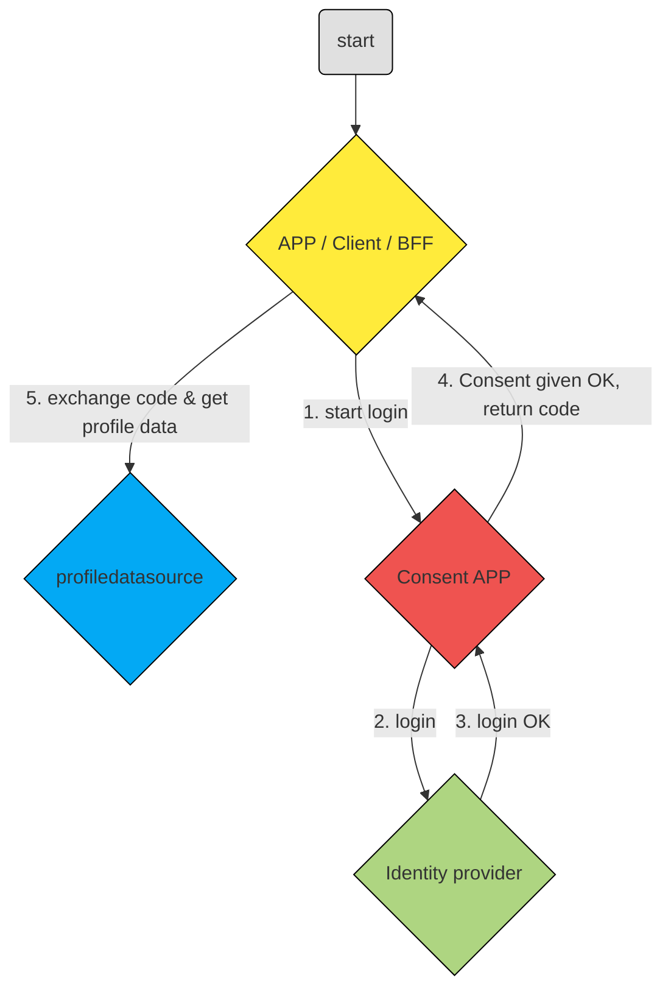
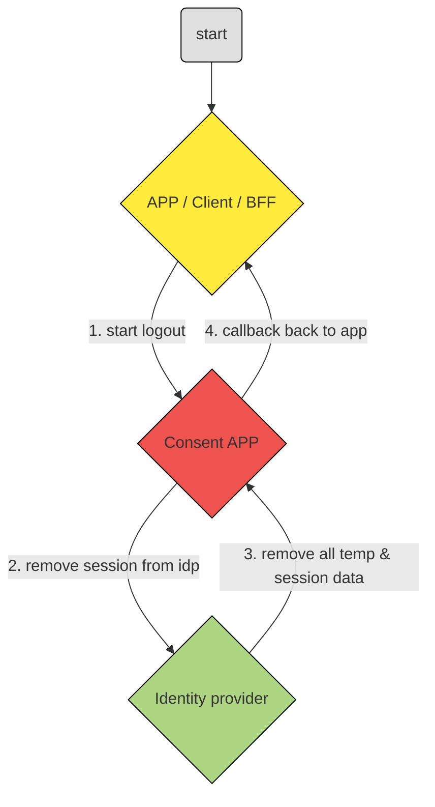

# Authorization-code flow
---

### Flow

1. klik login link en redirect naar consent app
2. redirect naar de IDP en login
3. login ok, redirect terug naar de consent app
4. consent vraag indien nodig
5. code naar /oauth/token endpoint met de Client ID en Client Secret. Dit resulteert in access token, Vraag userdata op met /me call

# logout flow
---

### Flow

1. klik logout link en redirect naar de consent app
2. redirect naar IDP
3. logout ok, redirect terug naar de consent app
4. data clear van tijdelijke bronnen en callback redirect naar app
5. app verwijderd local session
