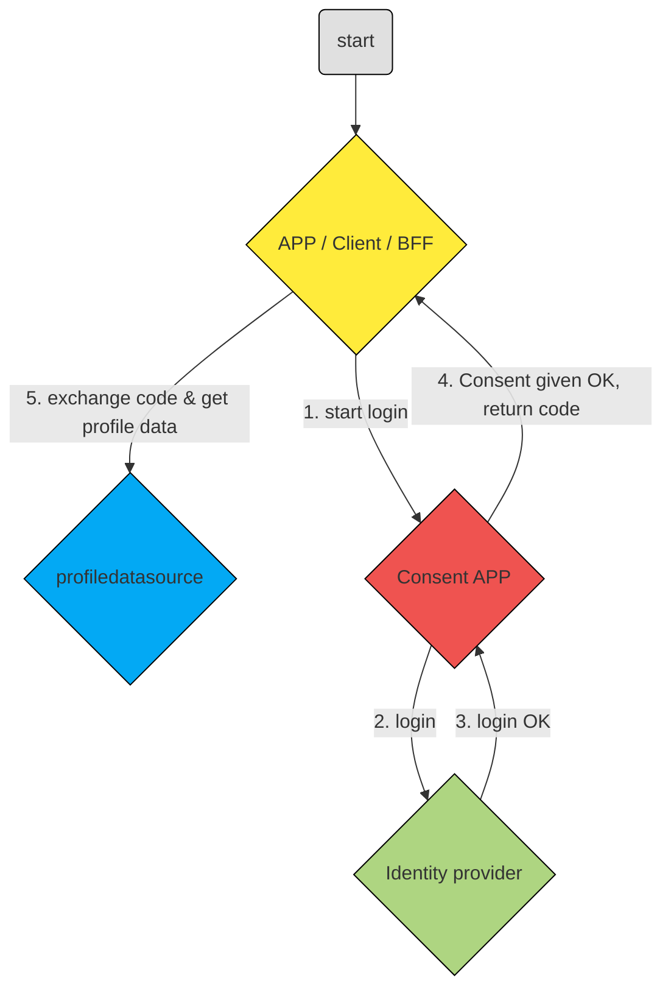

# Authorization-code flow
---

### Flow

1. Click login link and redirect to consent app
2. Redirect to IDP and enter authentication credentials
3. Login successful redirect back to consent app
4. Request consent if necessary
5. Sends code to /oauth/token endpoint along with the application's Client ID and Client Secret. This results in access token, Request userdata with /me call
